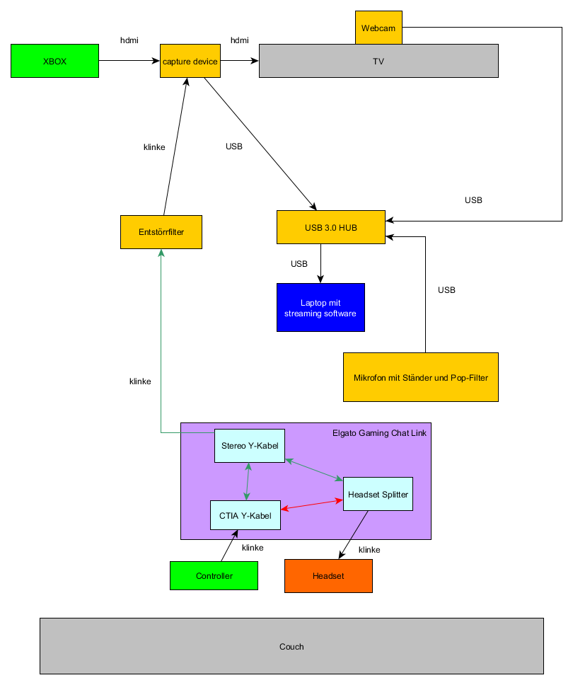

# Einrichten eines ersten Streaming Setups
Dieses Tutorial beschreibt wie ihr einen spitzen Streaming Setup einrichtet um Konsolen Couch-Gameplay über einen PC auf Mixer zu streamen.
Der Setup enthält im wesentlichen:
- Capture Device zum Erfassen des Gameplays von der Xbox
- Dediziertes Mikrofon
- PC mit Streaming Software zum Übertragen des ganzen.

Der Vorteil davon ist a) eine bessere Qualität als beim Streamen über die Xbox selbst und b) ein komplett individuell anpassbaren Overlay mit Einblendungen etc.

## Disclaimer
Ich habe selbst erst mit dem Streamen angefangen und dieses Tutorial auf Basis meines eigenen Streaming Setups (der ursprünglich von Brentarus zusammen gestellt wurde) erstellt. Ich habe aber insbesondere keinen Vergleich von verschiedenen Lösungen gemacht und kann euch daher nicht sagen, ob dies die "beste" Variante darstellt. Alles was ich sagen kann: für mich funktioniert's ;-)

Die Produktlinks auf Amazon dienen nur zur weiteren Information und stellen keine Werbung dar (insbesondere kein affiliate gedöns, ich kriege also nichts dafür, wenn ihr den Kram da kauft.)

## Aufbau
Zunächst eine Grafik die den Aufbau darstellt:

Oben links ist die Xbox abgeibildet. Da wir das Gaming-Bild am PC abgreifen wollen, brauchen wir ein "Capture Device". Es gibt entsprechende Karten, die man in einen PC einbauen kann oder die USB-Variante.
Ich habe mich für die [Elgato HD 60 S][1] entschieden. Preislich mit unter 200 EUR noch bezahlbar, unterstützt aber nur Full HD. D.h. ihr könnt sowohl nur Full HD streamen (wer hat sschon genug Uploadbandbreite für mehr?) aber auch auf eurem Fernseher nur mit Full HD gamen! 4K Lösungen kosten allerdings deutlich mehr.

Die Elgato wird per hdmi an die Xbox angeschlossen. Ihr liegt ein zweites HDMI Kabel, mit dem ihr die Elgato an den TV anschließt, bei. Das Signal wird abgegriffen und dann durchgereicht. Die Elgato wird per USB an einen PC angeschlossen um das Gaming zu capturen.

Da der von mir verwendete Laptop ([Surface Pro][2]) nur einen USB-Anschluss besitzt, habe ich einen ([USB-Hub von AUKEY][3]) zwischengeschaltet. Achtet darauf, dass dieser USB 3 besitzt und eine  externe Stromversorgung bereitstellt. Der Einsatz eines HUBS hat den weiteren Vorteil, dass ihr die Elgato auch mit ausgeschaltetem PC mit Strom versorgen könnt. Ohne geht nämlich auch das Zocken am TV nicht mehr.
Der Streaming PC muss kein Hardware Monster sein, aber sollte schon genügend RAM und Rechenleistung besitzen um das Full-HD Video störungsfrei zu verarbeiten. Ansonsten kommt es in eurem Stream zu rucklern.

Mit diesem Setup könntet ihr mit eingebauter Webcam und Microfon am Laptop im Prinzip bereits loslegen. Die von mir verwendete Streamingsoftware heißt "Streamlabs OBS" und erweitert das opensource Tool "Open Broadcaster Software" um ein bedienfreundliches UI. Die Bedienung von Slobs wäre ein eigenes Tutorial wert, was ich später vielleicht noch ergänze. Nur so viel: Ihr müsst die Elgato einfach als Videoquelle einfügen. Es bietet sich an zunächst mit Twitch die Einrichtung vorzunehmen, da dabei die optimalen Qualitätssettings automatisch ermittelt werden. Diese aufschreiben und dann Slobs resetten und manuell mit Mixer einrichten.

Gegenfalls solltet ihr noch eine externe Webcam anschließen um eine besseres Bild zu erhalten.

Richtig "nice" wird der Streaming Setup aber erst mit einem dedizierten Mikrofon. Neben besserer Sprachqualität gibt das auch optisch was her. Ich habe mich für das [Auna MIC-900BG][4] entschieden. Es sieht sehr cool aus und ist für unter 100 EUR zu haben. Das Mikrofon muss in einen Ständer eingehängt werden. Bspw. in den [Neewer][5] hängt ihr die sogenannten Spinne, die es erlaubt das Microfon abgeschirmt von Schwingungen der Umgebungen zu befestigen.
Zu guter letzt fehlt euch noch ein "Pop-Filter", dieser hält Störgeräusche vom Mikrofon fern. Ich verwende einen recht einfachen ebenfalls von [Neewer][6], der den Vorteil hat das man das Mikrofon im Stream noch recht gut optisch sehen kann.

Spielt ihr nur Solo ist der Setup im Prinzip komplett. Ansonsten solltet ihr noch das Party Audio in den Stream bekommen. Das ist gar nicht so einfach. Zwar kann man in den Xbox Einstellungen das Party-Audio auch über Hdmi ausgegeben lassen. Das Resultat war für mich aber nicht zufriedenstellend, da sich Game-Audio und Party-Audio nicht richtig mixen lassen. Die Alternative ist es das Audio direkt am Controller abzugreifen, dann hören eure Viewer genau das was ihr hört.
Leider ist das gar nicht so einfach zu bewerkstelligen. Im Prinzip müsstet ihr an euer Headset einen Splitter anschließen um Audio und Mikrofon Kanal zu trennen, da euer Mikrofon Kanal nicht an der Elgato ankommen soll (ihr habt ja ein dediziertes Micro und außerdem funktioniert das nicht, weil die Elgato nicht darauf ausgelegt ist). Den Audiokanal führt ihr dann in ein "Stereo Y-Kabel" um sozusagen "aus zwei eins zu machen". Einen Teil führt ihr dann per Klinke zur Elgato. Es empfiehlt sich einen [Entstörrfilter][8] zwischenzuschließen. Den anderen Teil führt ihr gemeinsam mit dem Mikrofon-Kanal in ein CTIA Y-Kabel um beide wieder zusammen zu führen. Das Y-Ende kommt dann in den Controller.
Zum Glück lässt sich dieser komplizierte Setup durch das [Elgato Chatlink Kabel][7] vereinfachen. Die Grafik hebt dies noch mal hervor.
Die Klinkekabel, welche auch Mikrofon-Kanäle transportierten, müssen 4-polig sein.
Ich verwende noch ein [Verlängerungskabel][9] zur Elgato, da meine Couch relativ weit weg vom Fernseher steht.

## Erweiterungsmöglichkeiten
Der Setup lässt sich noch weiter professionalisieren in dem man ein besonderes Headset verwendet, das weitere Möglichkeiten bietet den Game/Party Sound zu mixen, wie das A40 mit Mixamp. Außerdem macht sich ein Greenscreen ganz gut hinter euch. Beides habe ich selbst noch nicht getestet und werde das ggf. an späterer Stelle hier noch ergänzen.

***
© 2019 d33pfr13d

[//]: #Referenzen
[1]: <https://www.amazon.de/gp/product/B01DRWCOGA/ref=oh_aui_detailpage_o03_s00?ie=UTF8&psc=1> "Elgato Game Capture HD60 S"

[2]: <https://www.amazon.de/gp/product/B07BH8XF79/ref=oh_aui_detailpage_o06_s00?ie=UTF8&psc=1> "Microsoft Surface Pro 31,24 cm (12,3 Zoll) 2-in-1 Tablet (Intel Core i5, 128GB SSD, 8GB RAM, Win 10 Pro) Silber"

[3]: <https://www.amazon.de/gp/product/B00QWZAI8Q/ref=oh_aui_detailpage_o02_s00?ie=UTF8&psc=1> "AUKEY USB 3.0 Hub Ladefunktion 4 Port SuperSpeed 5Gbps mit 3 Ladeport 2.4A mit 36W Netzadapter"

[4]: <https://www.amazon.de/gp/product/B00GZ3SH1U/ref=oh_aui_detailpage_o05_s00?ie=UTF8&psc=1> "Auna MIC-900BG Kondensator-Mikrofon USB Mikrofon Studio"

[5]: <https://www.amazon.de/gp/product/B00DY1F2CS/ref=oh_aui_detailpage_o05_s00?ie=UTF8&psc=1> "Neewer Professionelle Einstellbare Faltbare Mikrofonständer mit Mikrofon Klipp-Montage"

[6]: <https://www.amazon.de/gp/product/B01GO138UW/ref=oh_aui_detailpage_o04_s00?ie=UTF8&psc=1> "Neewer® Schwarz Archy Aufnahmestudiomikrofon Maske Schild Mic Windschutz-Knall-Filter mit elastischem Gummibänder"

[7]: <https://www.amazon.de/gp/product/B017F85Q0S/ref=oh_aui_detailpage_o01_s00?ie=UTF8&psc=1> "Elgato Gaming Chat Link - Party Chat Adapter für PS4 und Xbox One"

[8]: <https://www.amazon.de/gp/product/B019FC6ZQQ/ref=oh_aui_detailpage_o04_s00?ie=UTF8&psc=1> "Entstörfilter Auto Radio Entstörer Noise Filter Noise Isolator ZIOCOM Erdschleifen-Eliminator für Audio System Heim Stereo, Ground Loop Isolator"

[9]: <https://www.amazon.de/gp/product/B07D287PDR/ref=oh_aui_detailpage_o00_s00?ie=UTF8&psc=1> "aceyoon 3,5 Klinke Verlängerung 5m 4 Polig Aux Kabel"

