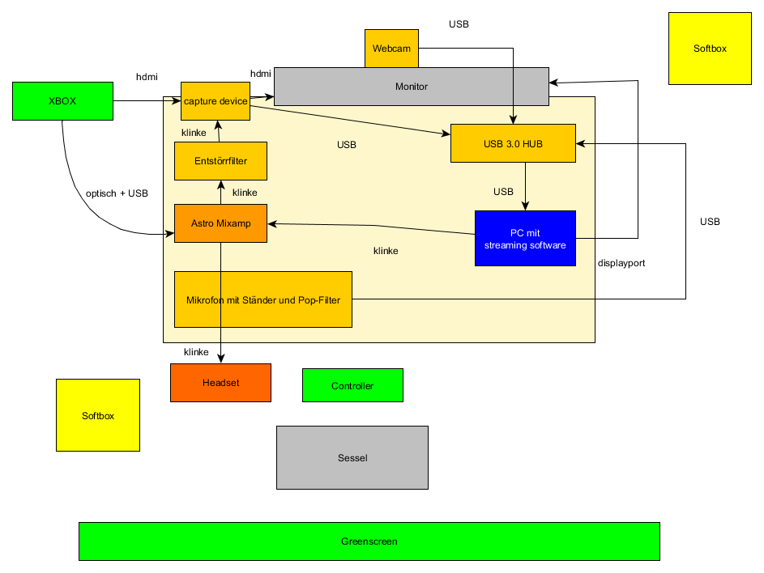

# Einrichten eines erweiterten Streaming Setups
Nachdem ich früher direkt von der Couch mit einem [einfachen Streaming Setup](EinrichtenEinesStreamingSetup.md) gestreamed habe, bin ich mittlerweile auf einen professionelleren Desktop-Setup umgestiegen.

Mein alter Setup hatte vorallem den Nachteil von schlechter Sound-Qualität, die sich insbesondere bemerkbar gemacht hat, als ich auf ein besseres Headset gewechselt bin. Der Sound-Output des Controllers ist suboptimal, weshalb im neuen Setup der Sound direkt an der Xbox abgegriffen wird.

Außerdem kommt bei mir nun ein Greenscreen zum Einsatz für mehr Immersion im Stream.

Im folgenden ist der Setup im Detail beschrieben. 

## Aufbau
Zunächst eine Grafik die den Aufbau darstellt:

Wie bisher hängt die Xbox an der [Elgato HD 60 S][1] um das Gameplay abzugreifen.
Der Sound wird nun aber über ein optisches Kabel mit dem [Astro Mixamp Pro Tr][2] verbunden. Das Party Audio wird dabei über eine zusätzliche USB-Verbindung direkt von der Xbox abgegriffen. Am Mixamp lässt sich das Lautstärke-Verhältnis von Game und Partychat für den Streamer regeln. Für die Viewer ist etwas mehr Fineabstimmung über eine Treiber-Software von Astro möglich. Der Anschluss des Audios an die Elgato ist weiterhin mit einem [Entstörfilter][10] "abgesichert".

Als Headset benutze ich den [beyerdynamic DT 990][11] Hifi-Kopfhörer mit [Antlion Audio ModMic V5][12] für das non-plus Ultra Sounderlebnis.

Wie bisher hängen Webcam, Elgato und Mikrofon über einen [USB3 HUB][6] am - nun aufgerüsteten - PC (Alienware Aurora). Als Mikrofon kommt weiterhin das [Auna Mic][3] zum Einsatz mit [Neweer Ständer][4] und [Neewer Pop-Filter][5].

Der [Greenscreen][7] kommt von Elgato und lässt sich leicht verstauen, wenn der Stream off ist.

Zur Beleuchtung setze ich 2 [Softboxen][8] von Geekoto ein. Man muss ein bischen mit der Platzierung spielen um gute Ergebnisse zu bekommen. Zusätzlich habe ich nun auch noch eine spezielle Webcam - [Razer Kiyo][9] - im Einsatz die eine eigene Beleuchtungslampe mitbringt. Die sorgt für eine gute Austrahlung des Streamers, während die Softboxen den Greenscreen ausstrahlen.

Als Streamingsoftware kommt OBS Studio zum Einsatz deseen Konfiguration ich noch getrennt beschreiben werde.

***
© 2020 d33pfr13d

[//]: #Referenzen
[1]: <https://www.amazon.de/gp/product/B01DRWCOGA/ref=oh_aui_detailpage_o03_s00?ie=UTF8&psc=1> "Elgato Game Capture HD60 S"

[2]: <https://www.amazon.de/ASTRO-Gaming-MixAmp-Pro-TR-Adapter-7-1-Surround-Sound-kompatibel-Xbox-One/dp/B014H2YSEK/ref=sr_1_25?__mk_de_DE=%C3%85M%C3%85%C5%BD%C3%95%C3%91&dchild=1&keywords=astro%2Bmixamp%2Bpro%2Btr%2Bxbox&qid=1589383482&sr=8-25&th=1> "Mixamp Pro TR"

[3]: <https://www.amazon.de/gp/product/B00GZ3SH1U/ref=oh_aui_detailpage_o05_s00?ie=UTF8&psc=1> "Auna MIC-900BG Kondensator-Mikrofon USB Mikrofon Studio"

[4]: <https://www.amazon.de/gp/product/B00DY1F2CS/ref=oh_aui_detailpage_o05_s00?ie=UTF8&psc=1> "Neewer Professionelle Einstellbare Faltbare Mikrofonständer mit Mikrofon Klipp-Montage"

[5]: <https://www.amazon.de/gp/product/B01GO138UW/ref=oh_aui_detailpage_o04_s00?ie=UTF8&psc=1> "Neewer® Schwarz Archy Aufnahmestudiomikrofon Maske Schild Mic Windschutz-Knall-Filter mit elastischem Gummibänder"

[6]: <https://www.amazon.de/gp/product/B00QWZAI8Q/ref=oh_aui_detailpage_o02_s00?ie=UTF8&psc=1> "AUKEY USB 3.0 Hub Ladefunktion 4 Port SuperSpeed 5Gbps mit 3 Ladeport 2.4A mit 36W Netzadapter"

[7]: <https://www.amazon.de/Elgato-Green-Paravent-gr%C3%BCn/dp/B0743Z892W/ref=sr_1_3?dchild=1&keywords=elgato+greenscreen&qid=1590589438&sr=8-3> "Elgato Green Screen Chroma-Key-Panel"

[8]: <https://www.amazon.de/gp/product/B07LFXBM8R/ref=ppx_yo_dt_b_asin_title_o00_s00?ie=UTF8&psc=1> "GEEKOTO Softbox Set Fotostudio"

[9]: <https://www.amazon.de/gp/product/B076QK6489/ref=ppx_yo_dt_b_asin_title_o02_s00?ie=UTF8&psc=1> "Razer Kiyo Streaming-Kamera mit Beleuchtung"

[10]: <https://www.amazon.de/gp/product/B019FC6ZQQ/ref=oh_aui_detailpage_o04_s00?ie=UTF8&psc=1> "Entstörfilter Auto Radio Entstörer Noise Filter Noise Isolator ZIOCOM Erdschleifen-Eliminator für Audio System Heim Stereo, Ground Loop Isolator"

[11]: <https://www.amazon.de/gp/product/B0024NK344/ref=ppx_yo_dt_b_search_asin_title?ie=UTF8&psc=1> "beyerdynamic DT 990 Edition 32 Ohm Over-Ear-Stereo Kopfhörer"

[12]: <https://www.amazon.de/AntLion-Audio-Dual-Mikrofon-Abnehmbar-Mute-Schalter-Schwarz/dp/B01MCYRKY3> "Antlion Audio ModMic V5 Dual-Mikrofon, abnehmbar, inkl. Mute-Button"